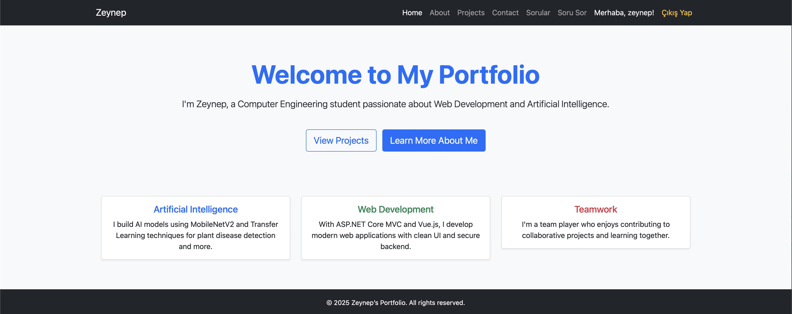
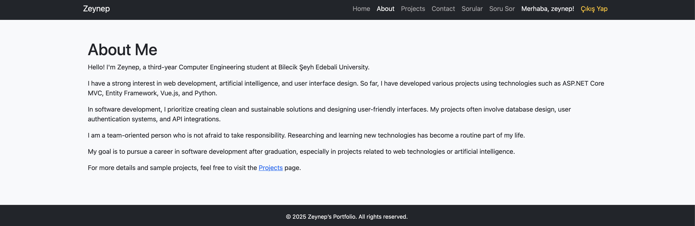
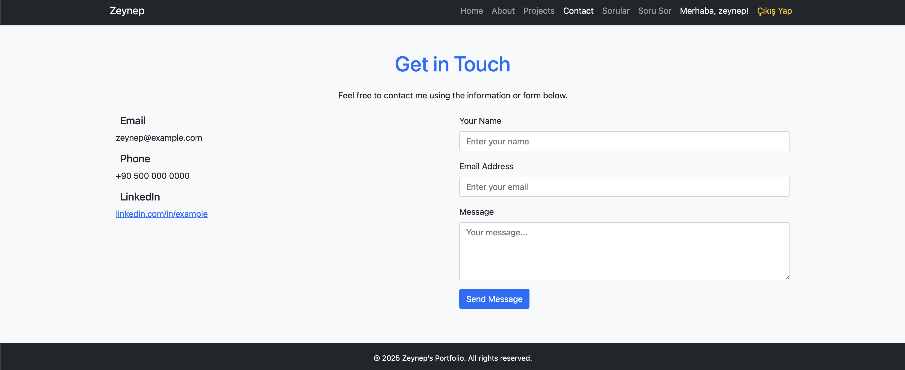
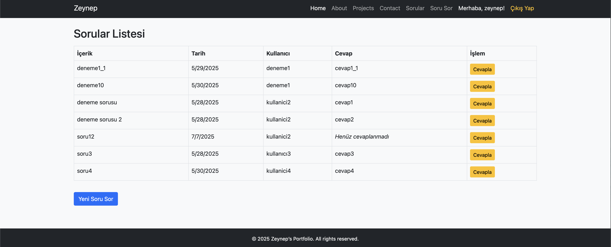
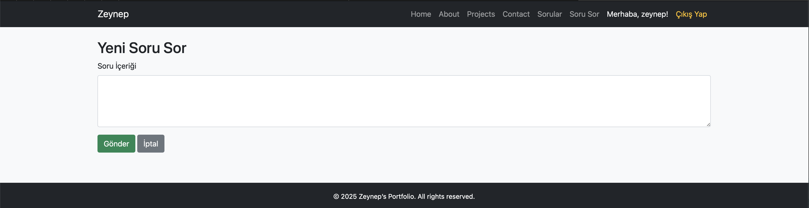

# QnA-Platform-ASPNetCoreMVC

Bu proje, **BM324 Web Uygulama Çatısı** dersi kapsamında geliştirilmiş bir **Soru & Cevap Platformu** uygulamasıdır.  
Kullanıcılar sisteme kayıt olabilir, giriş yapabilir, sorular sorabilir ve diğer kullanıcıların sorularına cevap verebilir.  
Admin paneli aracılığıyla tüm içerikler yönetilebilir.

---

## Özellikler

-  **Oturum Açma ve Kayıt Sistemi** (Authentication)
-  **Katmanlı Mimari** (Entities, DataAccess, Business, DTO, Controllers, Middleware)
-  **Veritabanı Yönetimi** → EF Core ile **Code First** yaklaşımı
-  **Custom Middleware** ile özel işlemler
-  **API Desteği** → Soru & cevapların dışarıya açılması
-  Kullanıcı dostu arayüz
-  API anahtarlarının güvenli yönetimi (.env / appsettings)

---

## Kullanılan Teknolojiler

- **ASP.NET Core MVC**
- **Entity Framework Core** (Code First & Migrations)
- **MSSQL Server**
- **Custom Middleware** (özelleştirilmiş işlemler için)

---

## Ekran Görselleri

Aşağıda uygulamaya ait bazı ekran görüntüleri yer almaktadır:

### Ana Sayfa & Hakkında Sayfası

### Projeler Sayfası

### İletişim

### Soru Sorma & Cevaplama

### Giriş 

---
